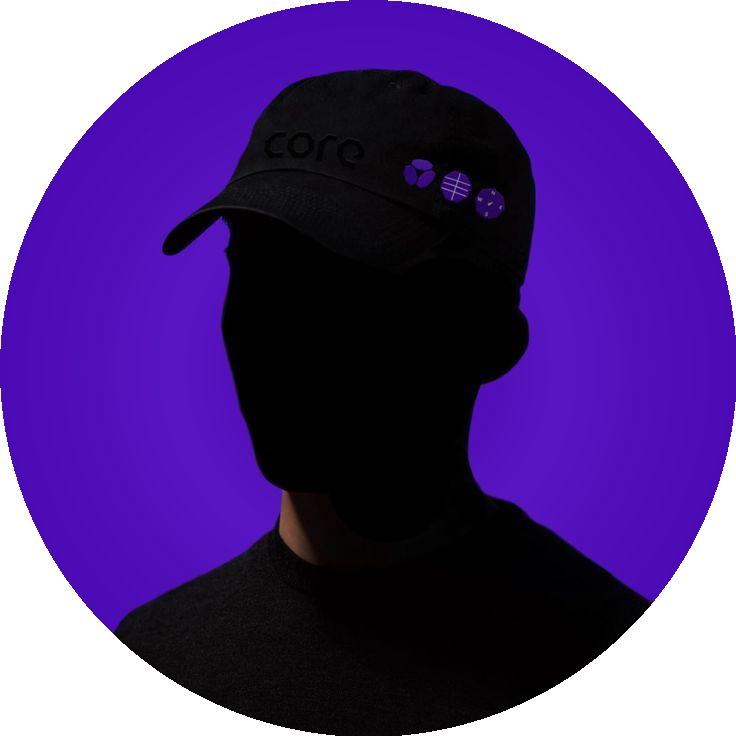

<h1 align="center">
  
  &nbsp; NetoCalouDev
</h1>

  

  

🎮 FiveM & GTA RP Developer • 🧩 Systems • 🖥️ NUI UI • ⚙️ Performance

  
  
  

---

## 🧠 My Vibe Statement

Desenvolvedor focado em sistemas completos para FiveM / GTA RP, com prioridade em:

- performance real (client e server)
- NUI moderna, leve e funcional
- integração total com vRP Creative
- código organizado e escalável
- facilidade de manutenção para staff
- validações server-side

---

## 📊 Status & Grind

### Repo / Build / Quality

  
  
  
  

---

## 🎧 Em execução no Spotify

  

---

## 🧰 Tech Stack

---

## 📌 Projetos (em construção)

### 🧱 Bases RP
- 🧩 Base RP — Tema Próprio
- 🏙️ Base RP — Tema São Paulo
- 🌴 Base RP — Tema Rio de Janeiro

### 🔧 Scripts
- 🎒 Inventário NUI
- 📱 Celular NUI
- 🏦 Sistema Bancário
- 🛠️ Sistema de Craft

---

## 🎯 Missão

Criar sistemas premium para GTA RP com foco em:

- experiência do jogador
- performance estável
- menos bugs em produção
- código limpo e padronizado
- fácil manutenção para staff

---

  

